# LaTex Code:

## Basic code of LaTex:

```tex
\documentclass{article}
\usepackage{graphicx} % Required for inserting images

\title{Programming with YoutubeUniversity}
\author{Md. Sohan Millat Sakib}
\date{December 2024}

\begin{document}

\maketitle      % Automatically show title, Athor and Date of document for this command
\vspace{-5mm} % Remove extra space
\begin{center}
    My name is Sohan Millat Sakib, a student\\ of Green University of Bangladesh
    %use \\ for add a new line
\end{center}


\section{Introduction}
\section{Data Tyepes}
\subsection{Premitive}
\subsubsection{Number}
\subsection{Non Premitive}
\section{Operators}
\end{document}


```

Output:

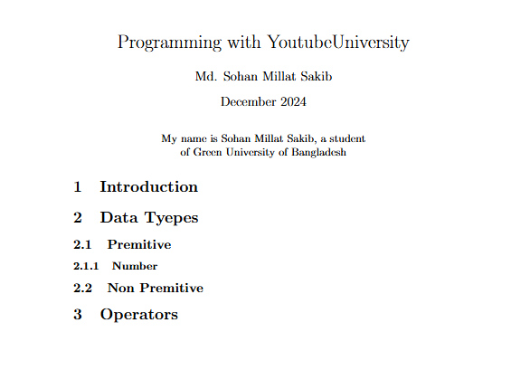

## Font Control:

Here we will learn how can we change different parameter of font or text.

```tex
\documentclass{article}

\title{Programming with YoutubeUniversity}
\author{Md. Sohan Millat Sakib}
\date{December 2024}

\begin{document}

\maketitle
\vspace{-5mm}
\section{Bangladesh}
\large
\textbf{Bangladesh is a small and beautiful country in South Asia.\\} %this is for make bold font

\small
\textit{We get independence in 1971 from Pakistan after a long war.\\}  %this is for make italic font

\huge
\underline{Because of the sacrifice of millions of freedom fighters.\\}

\large
\textbf{textit{16 December is our Victory Dasy because this day Pakistani army surrenderd}}

\tiny
Don't wory. This is tiny text.

\end{document}

```

Output:

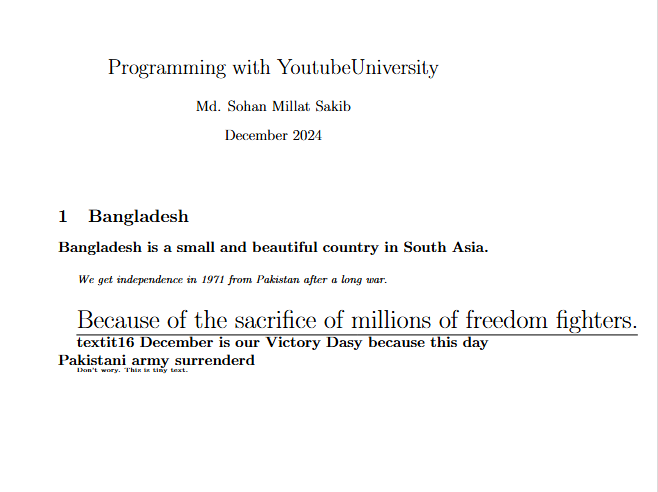

## Use Special Keywords

There have some special keyword in LaTex which are use in defferent purpose like `%`, `$`, `#`. If we try to use this keywords we got error form compiler. That's why we have to use `escape sign` for this. On the other hand sometime we have to use `copyright` or `registered` symbol. We can also make them using this escape charecter.

```tex
\documentclass{article}
\usepackage{graphicx} % Required for inserting images

\title{Programming with YoutubeUniversity}
\author{Md. Sohan Millat Sakib}
\date{December 2024}

\begin{document}

\maketitle
\section{Apple Company}
The company shares fell just over 2\% on Monday to close at \$175.74, reversing earlier gains that saw them aproach the \$182.86 price needed to record a \$3 trillion market value.
% using escape charecter for % and $

\# \\  % using escape charecter for #
\copyright\\
\textregistered   % using escape charecter for those symbol

\end{document}

```

Output:

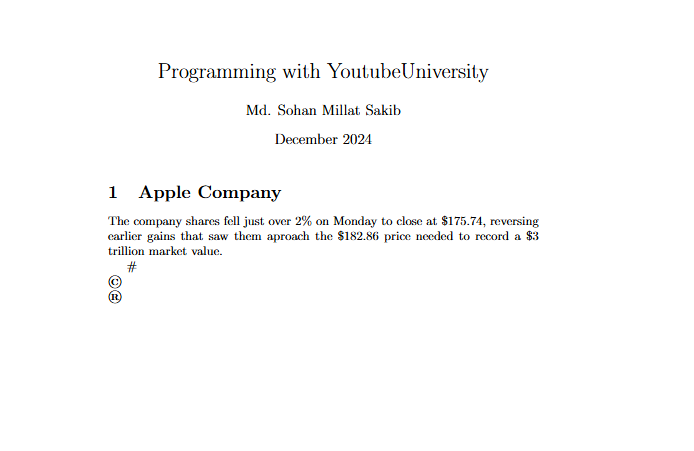

## Alignment & Layout

```tex
\documentclass{article}
\usepackage[a4 paper, landscape]{geometry} % import packagge for page setup

\title{Programming with YoutubeUniversity}
\author{Md. Sohan Millat Sakib}
\date{December 2024}

\begin{document}
\maketitle


\begin{flushleft}   % This is for left alignment
WorldCuup FootBall Quatar 2024
\end{flushleft}

\begin{flushright}    % This is for right alignment
WorldCuup FootBall Quatar 2024
\end{flushright}

\begin{center}     % This is for center alignment
WorldCuup FootBall Quatar 2024
\end{center}

\end{document}
```

Output:

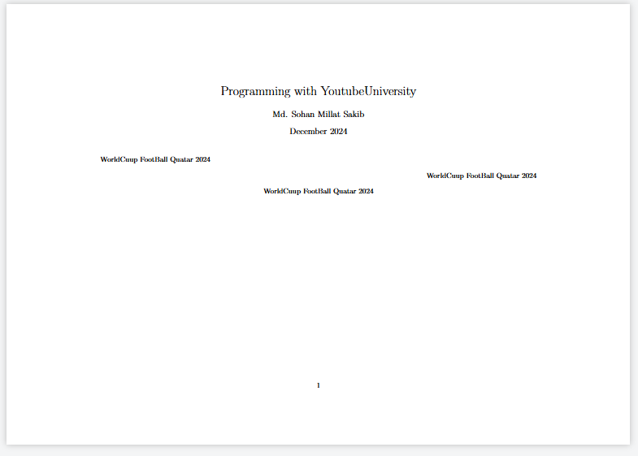

## List

Here All type of list code are available. Please follow the code below:

```tex
\documentclass{article}
\usepackage{paralist} % this package is for the list which will contain side by side
\usepackage{enumitem}  % this package is for making the custom item list
\title{Programming with YoutubeUniversity}
\author{Md. Sohan Millat Sakib}
\date{December 2024}

\begin{document}
\maketitle

\section{Football}
\begin{itemize}
    \item Brazil
    \item Arzentina
    \item Japan
    \item Ghana
\end{itemize}

\section{Cricket}
\begin{enumerate}
    \item Bangladesh
    \begin{itemize}
        \item Shakib
        \item Tamim
        \item Rony
    \end{itemize}
    \item India
    \item USA
    \item USB
\end{enumerate}

\section{Foods}     % this are works for importing paralist package
\begin{inparaenum}
\item apple
\item orange
\item tea
\end{inparaenum}

\section{Country}  %this are works for enumitem package
\begin{enumerate}[label=\alph*.]
    \item Bangladesh
\end{enumerate}


\section{Country}
\begin{enumerate}[label=\alph*.]
    \item Bangladesh
\end{enumerate}


\section{Country}
\begin{enumerate}[label=\roman*.]
    \item Bangladesh
\end{enumerate}

\section{Country}
\begin{enumerate}[label=\roman*.,start = 3]
    \item Bangladesh
\end{enumerate}


\end{document}

```

Output:


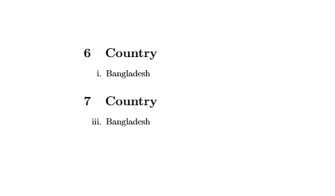

## URL and Hyper Link:

```tex
\documentclass{article}
\usepackage{url, hyperref}   %here we import the url and hyperref package
\title{Programming with YoutubeUniversity}
\author{Md. Sohan Millat Sakib}
\date{December 2024}

\begin{document}
\maketitle

\section{My URL}
\href{https://millatsakib.github.io/}{My Portfolio} \\
\url{www.google.com}
\end{document}
```

Output:

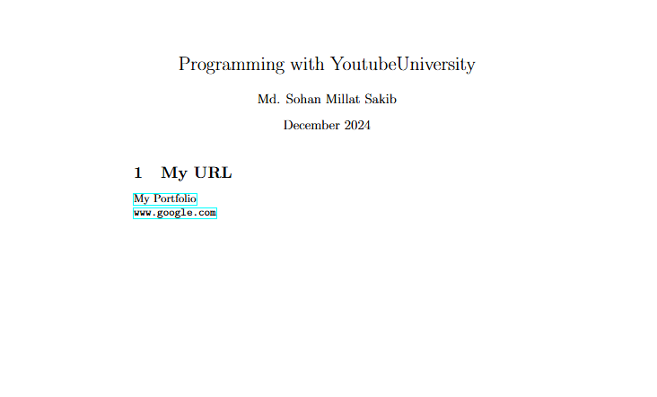

## Header Footer:

```tex
\documentclass{article}
\usepackage[utf8]{inputenc}
\usepackage{fancyhdr}
\pagestyle{fancy}
\lhead{Chapter 1}
\chead{Ruhul Amin}
\rhead{1}
\renewcommand{\headrulewidth}{0 pt}

\lfoot{bookname}
\cfoot{www.google.com}
\rfoot{save the world}

\begin{document}
hey.
\end{document}

```

Output:


## Custom Header Footer:

```tex
\documentclass{article}
\usepackage[utf8]{inputenc}
\usepackage{fancyhdr}
\pagestyle{fancy}
\lhead{Chapter 1}
\chead{Ruhul Amin}
\rhead{1}
\renewcommand{\headrulewidth}{0 pt}

\lfoot{bookname}
\cfoot{www.google.com}
\rfoot{save the world}

\fancypagestyle{style}{\fancyhf{}\fancyhead[l]{Mongol Groho}\fancyhead[c]{Chader Desh}\fancyhead[r]{2}}
\fancyfoot[1]{a}\fancyfoot[c]{b}\fancyfoot[r]{c}
\begin{document}
hey.
\newpage
\section{Second Page}
% \thispagestyle{empty} % this is for clear page header footer
\thispagestyle{style}
\end{document}
```

Output:


## Image

Shortcut way to to use image:

```tex
\documentclass{article}
\usepackage[utf8]{inputenc}
\usepackage{graphicx}

\begin{document}
\includegraphics[scale=0.4]{home.png}
\includegraphics[scale=.2]{ss4.jpg}
\end{document}
```

Output:

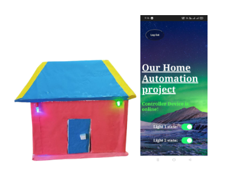

Right way to add image on latex file:

```tex

\documentclass{article}
\usepackage[utf8]{inputenc}
\usepackage{graphicx}


\begin{document}

\section{About the Home}
This is a demo home for Home automation. Anyone can on off the light of this home using the internet. For checkout this fig \ref{fig:home}

\begin{figure}[h]
\centering
\includegraphics[scale=0.4]{home.png}
\caption{Caption of Human Home}
\label{fig:home}
\end{figure}

This is my automatin fontend. Checkout it on fig \ref{fig:fontend}
\begin{figure}[h]
\centering
\includegraphics[scale=0.1]{ss4.jpg}
\caption{Caption of Automation frontend}
\label{fig:fontend}
\end{figure}

\end{document}
```

Output:

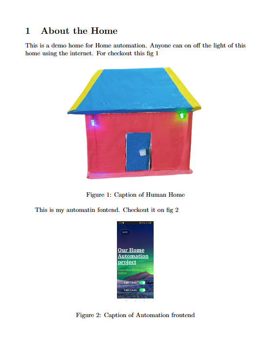

If we want that two image will keep on side by side then we can write that code:

```tex
\documentclass{article}
\usepackage[utf8]{inputenc}
\usepackage{graphicx}
\usepackage{subcaption} % Required for subfigure environment

\begin{document}

\begin{figure}[h!]
\centering
\begin{subfigure}{0.45\textwidth} % Adjust width to take up more space
    \centering
    \includegraphics[width=\linewidth]{home.png} % Scale to subfigure width
    \caption{Human Body}
\end{subfigure}
\hspace{0.05\textwidth} % Fine-tune horizontal spacing between images
\begin{subfigure}{0.25\textwidth} % Make the second subfigure width equal
    \centering
    \includegraphics[width=\linewidth]{ss4.jpg} % Scale to subfigure width
    \caption{Tree}
\end{subfigure}
\caption{Two images with reduced spacing between them.}
\label{fig:aligned-images}
\end{figure}

\end{document}
```

Output:

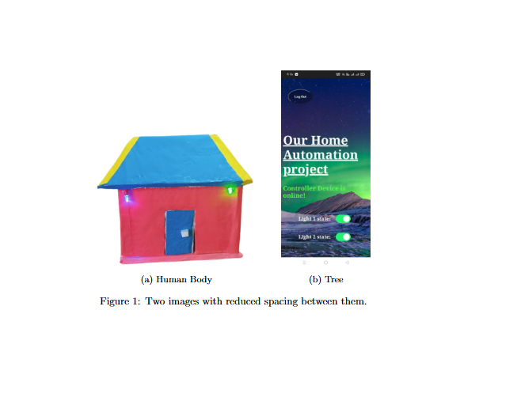

## Table:

We can make the table form [Here](https://tableconvert.com/latex-generator). The basic code of table are given below:

```tex
\documentclass{article}
\usepackage[utf8]{inputenc}
\usepackage{graphicx}
\usepackage{subcaption} % Required for subfigure environment

\begin{document}
\renewcommand{\arraystretch}{3.5} % This is for making gap on X axis
\setlength{\tabcolsep}{10pt}  % This is for making gap on Y axis
\begin{table}[!ht]
    \centering
    \begin{tabular}{|c|c|}
    \hline
        Amar sonar bangla ami tomay valobasi. & ~ \\ \hline
        ~ & ~ \\ \hline
    \end{tabular}
    \label{ipukljkl}
\end{table}

\end{document}
```

Output:

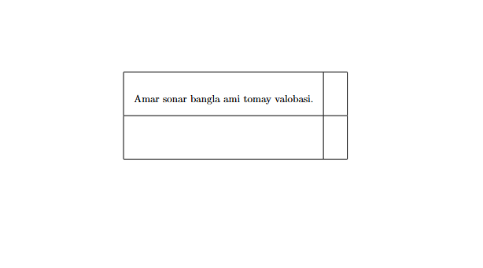

## Mathmethical Equation:

You can Generate the Mathmatica equation from [this](https://editor.codecogs.com/) website.

```tex
\documentclass{article}
\usepackage[utf8]{inputenc}
\usepackage{graphicx}
\usepackage{subcaption} % Required for subfigure environment

\begin{document}
\begin{center}
Donate Blood, Save A smile \\
Coding with YoutubeUniversity
\end{center}

$E = mc^2$  \\ % This is default superscript
$ x = a^{y+z} $ % This is default superscript

$$E = mc^2 $$   % This is centrelized superscript

$ log_{10} $

\begin{equation}
    \sum_{i+1}^{\infty}
    \prod_{i+1}^{\infty}
    \int_{i+1}^{\infty}
    \lim_{a\to7}
\end{equation}
\end{document}
```

Output:

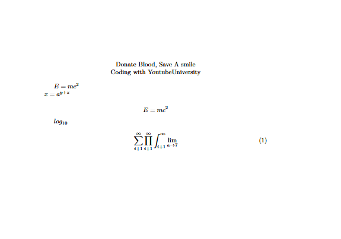
